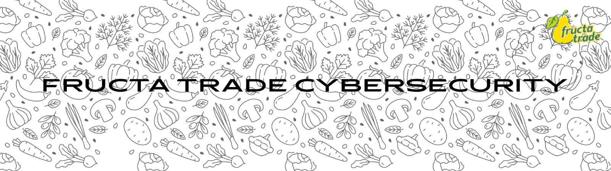

  

<h1 align="center">Fructa Trade Vulnerability Disclosure Program</h1>

  Vulnerability disclosure, triage and remediation.

---

## About

This organization is used for receiving, reviewing and resolving security vulnerability reports related to Fructa systems and digital assets.

## Reporting

A good security report should include:

- affected asset or endpoint;
- clear reproduction steps;
- demonstrated security impact;
- screenshots, requests, responses or proof-of-concept evidence.

## Report lifecycle

**New → Pending Program Review → Triaged → Retesting → Resolved**

Reports may also be closed as **Duplicate**, **Informative**, **Not Applicable** or **Spam**.

## Responsible testing

Please avoid service disruption, unnecessary access to sensitive data and denial-of-service testing.

---

  <strong>Thank you for helping us improve our security.</strong>

